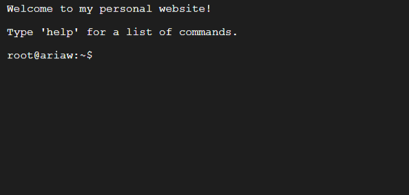

# Terminal Styled Personal Website

This project is a simple personal website designed to resemble an Ubuntu terminal. It allows users to type commands to get information, such as skills, projects, and contact details.

## Preview

## Online Demo

You can view a demo of the website here: https://iariaw.github.io/

## Commands

| Command  | Description                                   |
|----------|-----------------------------------------------|
| `help`   | Shows available commands.                     |
| `about`  | Provides a brief introduction.                |
| `skills` | Lists relevant skills (e.g., HTML, CSS).      |
| `projects` | Displays the project list.                  |
| `contact`| Provides contact details.                     |
| `cls`    | Clears the terminal screen.                   |
